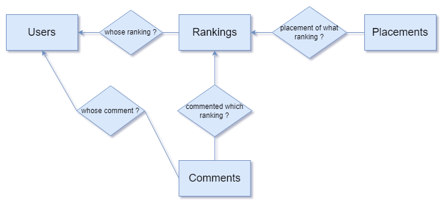
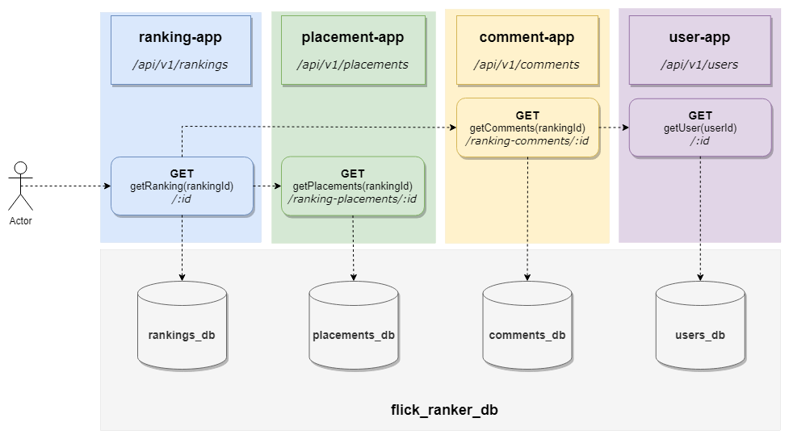

# flick-ranker

Website that allows users to make custom rankings of their favorite movies and shows. 

## Planned Functionalities

- sign in & sign up,
- browsing sets of movies and tv shows (data provided from `themoviedb.org`),
- making custom rankings:  
    - giving particular name to the ranking,
    - setting the order for the movies picked for ranking,
    - optional field for rules/description,
    - making ranking public or private,
- comment section for public rankings,
- liking rankings system,
- searching other users profiles and rankings.

**Tech stack:**
- `Spring Boot`,
- `Maven`,
- `Vue.js`,
- `Spring Security`,
- `Spring Data JPA`,
- `Lombok`,
- `PostgreSQL`,
- `Flyway`,
- `Docker`,
- `Open Feign`,
- `Eureka`.

**Conceptual ER diagram:**

**Retrieving ranking info - example of data flow in microservices system:**

